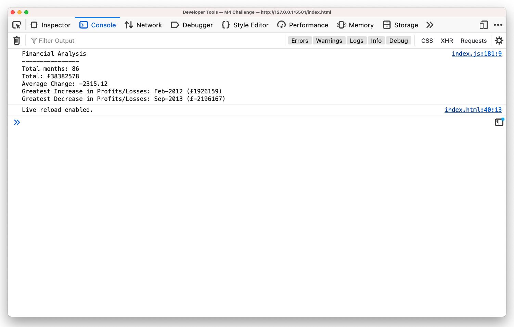

# Console-Finances

## Overview

This JavaScript project analyzes a dataset of financial records to calculate various metrics, including total months, total profit/loss, average change in profit/loss, greatest increase in profit/loss, and greatest decrease in profit/loss.

## Usage

To run the project, follow these steps:

- Open the `index.html` file in a web browser.
- Open the console in your web browser.
- The analysis results will be displayed in the console.

## Results

The project outputs the following financial analysis metrics to the console:

- **Total Months:** The total number of months included in the dataset.
- **Total:** The net total amount of Profit/Losses over the entire period.
- **Average Change:** The average of the changes in Profit/Losses over the entire period.
- **Greatest Increase in Profits/Losses:** The date and amount of the greatest increase in profit/loss.
- **Greatest Decrease in Profits/Losses:** The date and amount of the greatest decrease in profit/loss.

### ScreenShot

## Deployed at
[see deployed App](https://timatoyo.github.io/console-finances/){:target="_blank"}

## Code Structure

The project consists of a single HTML file (`index.html`) and a JavaScript file (`analysis.js`). The HTML file provides a way of accessing the console, while the JavaScript file contains the logic for analyzing the financial data and displaying the results to the console.

## Technologies

The project uses the following technologies:

- HTML
- JavaScript

## Contributing

Contributions to this project are welcome. Please follow these guidelines when contributing:

- Fork the repository to your own GitHub account.
- Create a new branch for your changes.
- Implement your changes and add tests to ensure they work as expected.
- Commit your changes and push them to your forked repository.
- Open a pull request to merge your changes into the upstream repository.

## License

This project is licensed under the MIT License.

